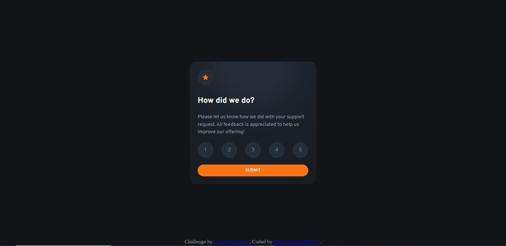
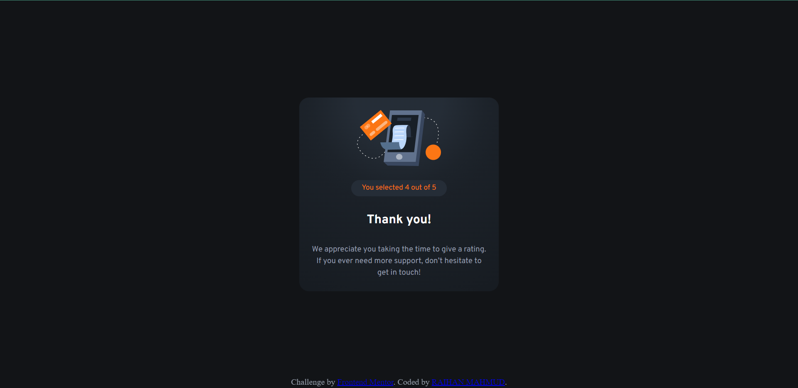

# Frontend Mentor - Interactive rating component solution

This is a solution to the [Interactive rating component challenge on Frontend Mentor](https://www.frontendmentor.io/challenges/interactive-rating-component-koxpeBUmI). Frontend Mentor challenges help you improve your coding skills by building realistic projects.

## Table of contents

- [Overview](#overview)
  - [The challenge](#the-challenge)
  - [Screenshot](#screenshot)
  - [Links](#links)
- [My process](#my-process)
  - [Built with](#built-with)
  - [What I learned](#what-i-learned)
  - [Continued development](#continued-development)
  - [Useful resources](#useful-resources)
- [Author](#author)
- [Acknowledgments](#acknowledgments)

## Overview

### The challenge

Users should be able to:

- View the optimal layout for the app depending on their device's screen size
- See hover states for all interactive elements on the page
- Select and submit a number rating
- See the "Thank you" card state after submitting a rating

### Screenshot




### Links

- Live Site URL: ([https://your-solution-url.com](https://interactive-rating-component-main-rose-ten.vercel.app/))

## My process

### Built with

- Semantic HTML5 markup
- CSS custom properties
- Flexbox
- CSS Grid
- Mobile-first workflow
- Vanilla JS
- Vanilla CSS

### What I learned

```css
.proud-of-this-css {
	background: radial-gradient(
		circle at top center,
		hsl(213, 19%, 18%) 20%,
		/* Initial color, 20% of the gradient height */ hsl(213, 19%, 14%) 40%,
		/* Transition to a slightly darker color */ hsl(213, 19%, 13%) 50%,
		/* Transition to an even darker color */ hsl(213, 19%, 12%) 80%,
		/* Transition to the darkest color */ hsl(213, 19%, 11%) 100% /* Stays the same color at the bottom */
	);
}
```

```js
let selectedValue;
ratingNumbers.forEach((element) => {
	element.addEventListener("click", () => {
		// Remove the "selected" class from all rating numbers
		ratingNumbers.forEach((rating) => {
			rating.classList.remove("selected");
		});

		// Add the "selected" class to the clicked rating number
		element.classList.add("selected");
		selectedValue = element.textContent;
		ratingElement.textContent =
			"You selected" + " " + selectedValue + " " + "out of 5";
	});
});

document.getElementById("submit").addEventListener("click", () => {
	// Get references to the first and second interface elements
	const ratingComponent = document.getElementById("rating-component");
	const thankComponent = document.getElementById("thank-component");

	if (selectedValue) {
		// Hide the first interface
		ratingComponent.classList.add("hidden");

		// Display the second interface
		thankComponent.classList.remove("hidden");
	} else {
		// Create a pop-up message element
		const popupMessage = document.createElement("h3");
		popupMessage.textContent = "Please add a review first";
		popupMessage.classList.add("popup-message");

		// Append the pop-up message to the document
		document.body.appendChild(popupMessage);

		// Remove the pop-up message after a certain time (e.g., 3 seconds)
		setTimeout(() => {
			popupMessage.remove();
		}, 3000);
	}
});
```

### Continued development

### Useful resources

- [Josh Comeau CSS Reset](https://www.joshwcomeau.com) - This helped me reset the CSS base early on to make the field clear to work on. I really liked this pattern and will use it going forward.
- [W3school](https://www.w3school.com) - This is a fantastic article which helped me finally understand Javascript DOM elements. I'd recommend it to anyone still learning this concept.

## Author

- Website - [Raihan Mahmud]
- Frontend Mentor - [@raihanmahmudiut](https://www.frontendmentor.io/profile/yourusername)
- Twitter - [@raihan\_\_mahmud](https://www.twitter.com/raihan__mahmud)

## Acknowledgments
